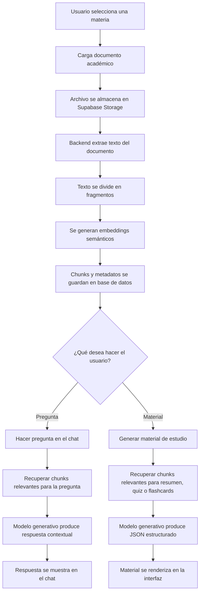

# LeerIA: Plataforma Inteligente para el Estudio Asistido por Documentos

**Proyecto Final - Introducción a la Inteligencia Artificial 2026-1**  
**Estudiantes:** Simón Sloan García Villa, Moisés Arturo Vergara Garcés, Hever Andre Alfonso Jimenez  
**Universidad EAFIT**  
**Periodo:** 2026-1

## Resumen

LeerIA es una plataforma web basada en inteligencia artificial para apoyar el estudio de documentos académicos mediante una arquitectura de recuperación aumentada por generación (*Retrieval-Augmented Generation*, RAG). El sistema permite organizar materias, cargar documentos, procesar su contenido, dividirlos en fragmentos, recuperar información relevante mediante búsqueda semántica y generar respuestas o materiales de estudio usando un modelo generativo. Entre sus funcionalidades se encuentran un chat contextual, generación de resúmenes, quizzes, flashcards y guiones de video, además de soporte para renderizado de expresiones matemáticas en LaTeX.

La solución integra procesamiento de lenguaje natural, recuperación de información, embeddings semánticos, modelos generativos de lenguaje e interfaz web funcional. La arquitectura está compuesta por un frontend en React, un backend en FastAPI y persistencia en Supabase. El objetivo principal es transformar documentos académicos extensos en una experiencia de estudio interactiva, personalizada y organizada por materias y conversaciones.

## Tabla de Contenido

- [Planteamiento del problema](#planteamiento-del-problema)
- [Objetivo general](#objetivo-general)
- [Metodología](#metodología)
- [Desarrollo](#desarrollo)
- [Resultados](#resultados)
- [Discusión](#discusión)
- [Interfaz de usuario](#interfaz-de-usuario)
- [Conclusiones](#conclusiones)
- [Instrucciones de instalación y ejecución](#instrucciones-de-instalación-y-ejecución)
- [Bibliografía](#bibliografía)

## Planteamiento del Problema

En contextos universitarios, los estudiantes suelen enfrentarse a grandes volúmenes de información en forma de PDFs, apuntes, presentaciones, lecturas y documentos técnicos. El proceso tradicional de estudio exige leer, subrayar, resumir, crear preguntas, identificar conceptos clave y preparar repasos de forma manual. Esta tarea puede ser lenta, repetitiva y poco personalizada.

Además, muchos estudiantes no solo necesitan leer el material, sino también interactuar con él: hacer preguntas, pedir explicaciones, generar ejercicios, construir flashcards y comprobar su comprensión antes de exámenes o sustentaciones. Sin embargo, las herramientas tradicionales de lectura de documentos no suelen ofrecer una experiencia integrada que combine carga de archivos, conversación contextual y generación automática de material de estudio.

El problema abordado por este proyecto es:

> ¿Cómo diseñar una plataforma inteligente que permita a un estudiante cargar documentos académicos, conversar con ellos y generar materiales de estudio personalizados usando técnicas de inteligencia artificial?

LeerIA surge como una solución a este problema. La aplicación permite al usuario organizar documentos por materias, crear conversaciones asociadas a cada materia, hacer preguntas sobre el contenido y generar materiales de estudio basados en los documentos procesados.

La motivación principal es mejorar la eficiencia del aprendizaje, reducir la carga manual de preparación académica y ofrecer una interfaz funcional que integre procesamiento documental, recuperación semántica y generación de lenguaje natural.

## Objetivo General

Desarrollar una plataforma web inteligente llamada **LeerIA** que permita a los estudiantes cargar documentos académicos, procesarlos mediante técnicas de procesamiento de lenguaje natural y utilizar modelos generativos para responder preguntas y crear materiales de estudio como resúmenes, quizzes, flashcards y guiones de video.

## Metodología

La metodología del proyecto se basó en el desarrollo incremental de una aplicación web con componentes de inteligencia artificial. El trabajo se organizó en fases que permitieron pasar desde la definición del problema hasta una solución funcional con interfaz de usuario, persistencia de datos, procesamiento documental y generación de contenido académico.

### Fases del desarrollo

El proceso general se dividió en las siguientes fases:

1. **Definición del problema:** se identificó la dificultad que tienen los estudiantes para estudiar grandes volúmenes de documentos académicos, resumirlos, formular preguntas y construir materiales de repaso.
2. **Diseño de arquitectura:** se definió una arquitectura separada en frontend, backend, base de datos, almacenamiento de archivos y servicios de inteligencia artificial.
3. **Gestión documental:** se implementó la carga de archivos por materia y su almacenamiento en Supabase Storage.
4. **Procesamiento de documentos:** el backend extrae el texto de los documentos, lo divide en fragmentos o *chunks* y almacena estos fragmentos junto con sus metadatos.
5. **Representación semántica:** cada fragmento documental se representa mediante embeddings, lo cual permite comparar semánticamente las preguntas del usuario con el contenido almacenado.
6. **Recuperación de información:** ante una pregunta o solicitud de material de estudio, el sistema recupera los fragmentos más relevantes de la materia seleccionada.
7. **Generación con modelo de lenguaje:** los fragmentos recuperados se entregan como contexto a un modelo generativo, el cual produce respuestas o materiales estructurados.
8. **Construcción de interfaz:** se desarrolló una interfaz web que permite crear materias, seleccionar conversaciones, subir documentos, escribir preguntas y generar materiales de estudio.
9. **Pruebas funcionales:** se validó manualmente el flujo completo del sistema, desde la carga de documentos hasta la generación de respuestas, resúmenes, quizzes y flashcards.

### Pipeline RAG implementado

La técnica central del proyecto es *Retrieval-Augmented Generation* (RAG). En lugar de enviar directamente la pregunta del usuario al modelo generativo, LeerIA primero busca en los documentos de la materia los fragmentos más relevantes. Luego, esos fragmentos son incluidos en el prompt entregado al modelo.

El pipeline implementado sigue los siguientes pasos:

1. El usuario sube un documento a una materia.
2. El documento se almacena en Supabase Storage.
3. El backend extrae el texto del documento.
4. El texto se divide en fragmentos pequeños.
5. Cada fragmento se almacena con metadatos como materia, documento, índice de chunk y ruta del archivo.
6. Se generan embeddings para representar semánticamente los fragmentos.
7. Cuando el usuario pregunta o solicita un material, se construye una consulta semántica.
8. El sistema recupera los chunks más relevantes.
9. Los chunks recuperados se insertan como contexto en el prompt.
10. El modelo generativo produce una respuesta o un material estructurado.
11. El resultado se guarda en la base de datos y se renderiza en la interfaz.

Este enfoque permite reducir la dependencia del conocimiento general del modelo y orientar las respuestas hacia los documentos cargados por el estudiante.

### Criterios de validación

Para validar el sistema, se realizaron pruebas funcionales sobre los flujos principales de la aplicación:

- carga y procesamiento de documentos;
- creación de materias y conversaciones;
- preguntas al chat basadas en documentos;
- generación de resúmenes;
- generación de quizzes;
- generación de flashcards;
- visualización de fórmulas matemáticas;
- separación de materiales generados por conversación.

La validación se enfocó en comprobar que el sistema funcionara de extremo a extremo y que los materiales generados fueran coherentes con los documentos cargados.

### Diagrama de flujo del proceso



## Desarrollo

### Descripción general de la solución

LeerIA se desarrolló como una aplicación web compuesta por tres capas principales:

- **Frontend:** interfaz de usuario construida con React y Vite.
- **Backend:** API REST construida con FastAPI.
- **Persistencia:** base de datos y almacenamiento de archivos mediante Supabase.

La aplicación permite organizar el estudio por materias. Cada materia puede tener documentos, conversaciones y materiales generados. El usuario puede seleccionar una materia, subir documentos, iniciar conversaciones y generar materiales de estudio.

### Conceptos de inteligencia artificial utilizados

El proyecto integra varios conceptos trabajados en el curso de Introducción a la Inteligencia Artificial.

#### Procesamiento de lenguaje natural

LeerIA procesa documentos académicos en lenguaje natural, extrae texto y permite al usuario hacer preguntas sobre el contenido. El sistema trabaja con texto no estructurado y lo transforma en fragmentos reutilizables para recuperación y generación.

#### Recuperación de información

El sistema usa una estrategia de recuperación de fragmentos relevantes. Cuando el usuario hace una pregunta o solicita generar material, el backend busca los chunks más relacionados con la consulta. Esto permite que el modelo no responda únicamente desde conocimiento general, sino desde el contenido documental de la materia.

#### Embeddings semánticos

Cada fragmento del documento se representa mediante embeddings, es decir, vectores numéricos que capturan información semántica del texto. Estos vectores permiten comparar la similitud entre una pregunta y los fragmentos almacenados.

#### Modelos generativos de lenguaje

LeerIA utiliza un modelo de lenguaje para generar respuestas, resúmenes, preguntas de quiz, flashcards y guiones de video. El modelo recibe como entrada el contexto documental recuperado y produce una salida en lenguaje natural o en JSON estructurado.

#### RAG: Retrieval-Augmented Generation

La técnica principal utilizada es *Retrieval-Augmented Generation* o RAG. Esta técnica combina recuperación de información con generación de texto. Primero se recuperan fragmentos relevantes de los documentos y luego se entregan como contexto al modelo generativo.

#### Uso de API generativa

En lugar de entrenar un modelo de lenguaje desde cero, LeerIA utiliza una API generativa como componente de generación de respuestas. Esta decisión permite acceder a un modelo avanzado con menor costo de desarrollo, menor requerimiento de infraestructura y mayor velocidad de implementación.

El valor del proyecto no está únicamente en el modelo utilizado, sino en la arquitectura construida alrededor de este: procesamiento documental, fragmentación, recuperación semántica, construcción de prompts, persistencia de conversaciones, generación de artefactos y renderizado en interfaz. De esta forma, el modelo generativo funciona como una pieza dentro de un sistema RAG completo.

### Arquitectura del sistema

La arquitectura general de LeerIA se compone de los siguientes módulos:

- **Gestión de materias:** creación, edición y selección de materias.
- **Gestión de documentos:** subida, almacenamiento, procesamiento y listado de documentos.
- **Gestión de conversaciones:** creación de conversaciones por materia.
- **Chat RAG:** preguntas y respuestas basadas en documentos.
- **Generador de materiales:** creación de resúmenes, quizzes, flashcards y guiones de video.
- **Renderizado matemático:** visualización de fórmulas usando LaTeX y KaTeX.

### Tecnologías utilizadas

| Tecnología | Uso dentro del proyecto |
| --- | --- |
| React + Vite | Construcción de la interfaz web. |
| TypeScript | Tipado del frontend y mayor robustez en componentes. |
| Tailwind CSS | Estilizado visual de la aplicación. |
| FastAPI | Construcción de la API REST del backend. |
| Supabase | Base de datos, almacenamiento de archivos y persistencia de entidades. |
| OpenAI API / Modelo generativo | Generación de respuestas y materiales de estudio. |
| Embeddings | Representación semántica de los fragmentos documentales. |
| KaTeX | Renderizado de fórmulas matemáticas en la interfaz. |

### Modelo de datos

El sistema maneja varias entidades principales:

- **Subject:** representa una materia.
- **Document:** representa un archivo subido por el usuario.
- **DocumentChunk:** representa un fragmento procesado del documento.
- **Conversation:** representa una conversación asociada a una materia.
- **Message:** representa mensajes del usuario y del asistente.
- **GeneratedItem:** representa materiales generados como resumen, quiz, flashcards o guion.

Una decisión importante fue asociar los materiales generados no solo a una materia, sino también a una conversación mediante `conversation_id`. Esto evita que diferentes conversaciones dentro de una misma materia reutilicen siempre el mismo resumen, quiz o conjunto de flashcards.

### Backend

El backend está construido con FastAPI y expone endpoints REST para:

- crear y consultar materias;
- subir y procesar documentos;
- crear y consultar conversaciones;
- enviar mensajes al chat;
- generar materiales de estudio;
- recuperar artefactos generados.

El flujo de generación de material sigue esta lógica:

1. el usuario solicita un tipo de material;
2. el frontend envía `subject_id`, `conversation_id`, tipo de material y parámetros de generación;
3. el backend recupera fragmentos relevantes de los documentos;
4. el modelo generativo produce una respuesta estructurada;
5. el resultado se guarda en la tabla `generated_items`;
6. el frontend renderiza el material en una vista especializada o en una vista genérica según el tipo de artefacto.

### Frontend

El frontend incluye una interfaz dividida en tres zonas:

- **Sidebar izquierdo:** muestra materias y conversaciones.
- **Área central:** muestra chat, estado vacío, resúmenes, quizzes, flashcards o artefactos generados en formato estructurado.
- **Panel derecho:** muestra herramientas de estudio, documentos recientes y estado del sistema.

El usuario puede interactuar con LeerIA sin necesidad de usar consola ni conocer detalles técnicos del backend. Esta interfaz cumple con el requisito de interacción directa con el sistema.

### Bot conversacional de apoyo

LeerIA incluye un bot conversacional integrado. Este bot permite hacer preguntas sobre los documentos cargados y recibir explicaciones en lenguaje natural. El bot utiliza los fragmentos recuperados como contexto para responder, lo cual reduce el riesgo de respuestas inventadas y mejora la trazabilidad hacia los documentos de la materia.

### Renderizado de matemáticas

Dado que LeerIA está orientado a documentos académicos, especialmente materias como cálculo, álgebra o estadística, se implementó soporte para expresiones matemáticas. Las fórmulas se generan en LaTeX y se renderizan en el frontend usando KaTeX.

Ejemplo de una fórmula que puede ser renderizada por el sistema:

$$
\iiint_V \nabla \cdot \mathbf{F}\, dV =
\iint_S \mathbf{F} \cdot \mathbf{n}\, dS
$$

Esto permite que el sistema sea útil no solo para textos generales, sino también para documentos técnicos y matemáticos.

## Resultados

### Funcionalidades implementadas

LeerIA logró implementar un flujo completo de estudio asistido por inteligencia artificial. Las funcionalidades principales desarrolladas fueron:

- creación, edición y visualización de materias;
- creación de conversaciones independientes por materia;
- carga de documentos académicos;
- procesamiento de documentos y división en chunks;
- almacenamiento de documentos, fragmentos y metadatos;
- recuperación de fragmentos relevantes mediante búsqueda semántica;
- chat contextual basado en documentos;
- generación automática de resúmenes;
- generación automática de quizzes;
- generación automática de flashcards;
- generación de guiones de video como artefacto adicional;
- renderizado de expresiones matemáticas con LaTeX y KaTeX;
- separación de materiales generados por conversación mediante `conversation_id`;
- interfaz web funcional e intuitiva.

Estas funcionalidades demuestran que el sistema no se limita a una prueba aislada de inteligencia artificial, sino que integra el modelo generativo dentro de una aplicación completa con flujo de usuario, persistencia y visualización.

### Evidencia del funcionamiento

La aplicación permite ejecutar el siguiente flujo completo:

1. El usuario crea o selecciona una materia.
2. El usuario sube un documento académico.
3. El backend almacena y procesa el documento.
4. El documento se divide en fragmentos.
5. Los fragmentos quedan disponibles para recuperación semántica.
6. El usuario realiza una pregunta en el chat.
7. El sistema recupera los chunks más relevantes.
8. El modelo generativo produce una respuesta contextual.
9. El usuario genera materiales de estudio.
10. El sistema guarda y muestra resúmenes, quizzes o flashcards.

Durante las pruebas se verificó que el usuario puede interactuar con documentos reales, recibir respuestas basadas en el contenido cargado y generar materiales de estudio desde la interfaz.

### Pruebas funcionales realizadas

Para validar el funcionamiento de LeerIA, se realizaron pruebas sobre los flujos principales del sistema.

| Prueba | Resultado esperado | Resultado obtenido | Observación |
| --- | --- | --- | --- |
| Creación de materia | Registrar una nueva materia en la aplicación. | Correcto | La materia aparece en el panel lateral y puede seleccionarse. |
| Subida de documento | Almacenar el archivo y asociarlo a una materia. | Correcto | El documento queda registrado y visible en el panel de documentos. |
| Procesamiento documental | Extraer texto y crear chunks. | Correcto | El sistema genera fragmentos recuperables desde el backend. |
| Pregunta en chat | Responder usando el contenido documental. | Correcto | El asistente responde con base en chunks recuperados. |
| Generación de resumen | Crear un resumen estructurado. | Correcto | El resumen se muestra en una vista especializada. |
| Generación de quiz | Crear preguntas con opciones y explicación. | Correcto | El quiz permite seleccionar respuestas y mostrar retroalimentación. |
| Generación de flashcards | Crear tarjetas de estudio. | Correcto | Las flashcards se muestran con animación de giro. |
| Cambio de conversación | Evitar reutilizar materiales de otra conversación. | Correcto | Se corrigió asociando materiales a `conversation_id`. |
| Renderizado matemático | Mostrar fórmulas correctamente. | Correcto | Se integró LaTeX y KaTeX para chat y materiales. |

### Evaluación cualitativa

La evaluación cualitativa se centró en tres aspectos: pertinencia de las respuestas, utilidad de los materiales generados y funcionamiento de la interfaz.

- **Pertinencia:** las respuestas del chat se mantuvieron relacionadas con los documentos de la materia cuando la recuperación entregó chunks relevantes.
- **Utilidad:** los resúmenes, quizzes y flashcards generados fueron útiles para repasar conceptos, formular preguntas y estudiar de manera activa.
- **Interfaz:** la aplicación permitió ejecutar el flujo completo sin necesidad de usar consola, scripts externos o herramientas adicionales.

### Problemas encontrados y correcciones

Durante el desarrollo se identificaron varios problemas técnicos que fueron corregidos:

- **Reutilización incorrecta de materiales:** inicialmente, los materiales generados se asociaban solo a una materia. Esto hacía que diferentes conversaciones reutilizaran el mismo resumen, quiz o conjunto de flashcards. La solución fue agregar `conversation_id` a los artefactos generados.
- **Recuperación demasiado general:** al generar materiales, el sistema podía recuperar información de toda la materia sin considerar el contexto de la conversación. Se ajustó el flujo para incorporar el contexto conversacional en la consulta de generación.
- **Renderizado matemático incorrecto:** algunas fórmulas se mostraban como texto plano. Se integró KaTeX y se reforzaron los prompts para solicitar fórmulas en formato LaTeX.
- **Formato inconsistente de respuestas:** algunos materiales generados no seguían siempre la estructura esperada. Se mejoraron los prompts para exigir salidas en JSON válido en los artefactos de estudio.

Estas correcciones evidencian que el desarrollo no fue únicamente una integración directa con un modelo generativo, sino un proceso iterativo de diseño, prueba y ajuste de una aplicación inteligente.

### Métricas propuestas para trabajo futuro

Aunque el sistema fue validado funcionalmente, se identifican métricas que podrían fortalecer la evaluación cuantitativa en futuras versiones:

| Métrica | Descripción | Estado |
| --- | --- | --- |
| Tiempo de procesamiento | Tiempo desde la subida del documento hasta la creación de chunks. | Por medir |
| Precisión de recuperación | Proporción de chunks recuperados que son relevantes para la pregunta. | Por medir |
| Calidad de respuesta | Evaluación humana de claridad, utilidad y fidelidad al documento. | Evaluación manual |
| Consistencia del material generado | Verificación de que resúmenes, quizzes y flashcards correspondan al documento. | Evaluación manual |
| Costo por consulta | Estimación del costo promedio al usar la API generativa. | Por medir |
| Satisfacción de usuario | Facilidad percibida para estudiar con la herramienta. | Por medir |

## Discusión

LeerIA se relaciona con una línea reciente de herramientas de aprendizaje asistido por inteligencia artificial que combinan modelos generativos, recuperación de información y asistentes conversacionales sobre documentos. En particular, el proyecto se apoya en el enfoque conocido como *Retrieval-Augmented Generation* (RAG), el cual busca complementar la capacidad generativa de los modelos de lenguaje con información externa recuperada desde una base documental específica.

A diferencia de un chatbot general, LeerIA no está diseñado para responder únicamente desde el conocimiento general del modelo, sino para trabajar sobre documentos cargados por el estudiante. Esto permite que las respuestas, resúmenes, quizzes y flashcards estén directamente relacionados con el material académico de una materia. Esta decisión es importante porque en contextos educativos no basta con generar respuestas fluidas: también es necesario que las respuestas sean pertinentes, trazables y consistentes con las fuentes de estudio disponibles.

El enfoque RAG utilizado en LeerIA permite dividir los documentos en fragmentos, representar esos fragmentos mediante embeddings y recuperar los más relevantes cuando el usuario realiza una pregunta o solicita un material de estudio. Posteriormente, el modelo generativo utiliza esos fragmentos como contexto para producir una respuesta. De esta manera, el sistema combina dos componentes fundamentales de inteligencia artificial: recuperación semántica de información y generación de lenguaje natural.

### Comparación con herramientas y enfoques relacionados

LeerIA puede compararse con distintas herramientas existentes y enfoques cercanos al estado del arte. Aunque existen plataformas comerciales que permiten conversar con documentos o generar materiales educativos, LeerIA se diferencia por integrar en una misma aplicación la organización por materias, conversaciones, procesamiento documental, chat contextual y generación de materiales de estudio.

| Herramienta o enfoque | Características principales | Comparación con LeerIA |
| --- | --- | --- |
| ChatGPT tradicional | Permite hacer preguntas generales y recibir respuestas en lenguaje natural. | LeerIA limita el contexto a los documentos de una materia, organiza conversaciones y genera materiales académicos estructurados. |
| ChatPDF y herramientas similares | Permiten subir un PDF y hacer preguntas sobre su contenido. | LeerIA no se limita al chat con un único documento; organiza materias, múltiples documentos, conversaciones y genera resúmenes, quizzes y flashcards. |
| NotebookLM y asistentes documentales | Permiten trabajar con fuentes cargadas y generar explicaciones o resúmenes. | LeerIA implementa una versión propia del flujo RAG, con una interfaz personalizada, control de backend, persistencia en base de datos y separación por conversaciones. |
| Quizlet y aplicaciones de flashcards | Permiten crear o estudiar tarjetas de memoria. | LeerIA genera automáticamente flashcards desde los documentos cargados, reduciendo el trabajo manual del estudiante. |
| Sistemas RAG tradicionales | Recuperan fragmentos relevantes y los entregan a un modelo generativo. | LeerIA aplica RAG a un caso educativo concreto, agregando interfaz, gestión de materias, generación de materiales y visualización matemática. |

Esta comparación muestra que LeerIA no pretende ser únicamente un chatbot ni únicamente una herramienta de resumen. Su aporte está en integrar varias capacidades en un flujo de estudio completo: cargar documentos, procesarlos, conversar con ellos, generar materiales, revisar conceptos y practicar mediante preguntas.

### Uso de una API de GPT

Una decisión técnica importante fue utilizar una API de GPT como componente generativo del sistema. Esta elección tiene varias ventajas. En primer lugar, permite aprovechar un modelo de lenguaje avanzado sin necesidad de entrenar un modelo propio desde cero, lo cual sería costoso en términos de datos, infraestructura, tiempo de entrenamiento y capacidad computacional. En segundo lugar, facilita integrar generación de lenguaje natural de alta calidad dentro de una arquitectura propia, manteniendo el control sobre el flujo de recuperación, almacenamiento, prompts, estructura de respuestas e interfaz.

Además, el uso de una API permite un modelo de costos más controlable para un prototipo académico. En lugar de depender necesariamente de una suscripción fija tradicional para cada usuario, la aplicación puede consumir el modelo bajo demanda, pagando únicamente por las solicitudes realizadas. Esto puede representar una ventaja económica en escenarios de uso moderado o controlado, como una demo académica, una prueba piloto o un sistema usado por un grupo pequeño de estudiantes. Sin embargo, esta ventaja depende del volumen real de uso: si el número de usuarios o consultas crece significativamente, sería necesario analizar costos, límites de uso, optimización de prompts, cantidad de tokens enviados y estrategias de caché.

Es importante aclarar que la precisión del sistema no depende únicamente del modelo GPT. La calidad final de la respuesta está determinada por la combinación de varios factores: calidad del documento cargado, extracción correcta del texto, división adecuada en fragmentos, calidad de los embeddings, recuperación de chunks relevantes y diseño del prompt. Por esta razón, LeerIA no usa el modelo generativo como una caja negra aislada, sino como parte de una arquitectura RAG donde el backend controla qué información se entrega al modelo y cómo debe responder.

### Ventajas de LeerIA

Entre las ventajas principales del sistema se encuentran:

- **Contextualización por materia:** los documentos se organizan según la materia del estudiante, lo que permite separar dominios de conocimiento.
- **Conversaciones independientes:** los materiales generados se asocian a una conversación específica mediante `conversation_id`, evitando que distintas conversaciones reutilicen incorrectamente el mismo resumen, quiz o conjunto de flashcards.
- **Generación de materiales estructurados:** el sistema no solo responde preguntas, sino que también genera objetos de estudio con estructura definida, como resúmenes, quizzes y flashcards.
- **Interfaz funcional:** LeerIA ofrece una experiencia completa de usuario, con panel de materias, conversaciones, documentos recientes, chat y herramientas de estudio.
- **Soporte para contenido matemático:** la integración con LaTeX y KaTeX permite visualizar fórmulas matemáticas de manera más clara, lo cual es especialmente útil en materias como cálculo, álgebra o estadística.
- **Arquitectura extensible:** al estar construida con frontend, backend, base de datos y servicios desacoplados, la plataforma puede ampliarse con nuevas funcionalidades.

### Limitaciones

A pesar de sus ventajas, LeerIA también presenta limitaciones importantes:

- **Dependencia de la calidad del documento:** si el PDF tiene mala extracción de texto, fórmulas corruptas o caracteres mal interpretados, el contexto entregado al modelo puede ser incompleto o incorrecto.
- **Limitaciones en documentos matemáticos:** aunque el sistema renderiza LaTeX en la interfaz, la extracción automática de fórmulas desde PDFs sigue siendo un reto. En algunos casos, las fórmulas pueden requerir corrección o normalización adicional.
- **Posibilidad de respuestas incorrectas:** aunque RAG reduce el riesgo de alucinación, no lo elimina completamente. El usuario debe verificar la información importante.
- **Evaluación cuantitativa limitada:** hasta el momento, la validación se ha centrado principalmente en pruebas funcionales y evaluación manual. Sería deseable incorporar métricas formales de recuperación, precisión y calidad de respuesta.
- **Dependencia de servicios externos:** el sistema depende de una API generativa y de servicios de almacenamiento/base de datos. Esto introduce consideraciones de costo, disponibilidad y límites de uso.
- **Escalabilidad:** para un prototipo académico, la arquitectura es suficiente. Sin embargo, en un escenario con muchos usuarios concurrentes sería necesario optimizar procesamiento, almacenamiento de embeddings, caché y control de costos.

### Análisis crítico

LeerIA demuestra que una arquitectura RAG puede aplicarse de forma efectiva a un problema real de estudio universitario. Su mayor fortaleza está en integrar procesamiento documental, recuperación semántica, generación de lenguaje natural e interfaz de usuario en una sola plataforma. Esto permite pasar de una experiencia pasiva de lectura a una experiencia activa de interacción con los documentos.

Sin embargo, el proyecto también muestra que construir una aplicación de inteligencia artificial útil no consiste únicamente en conectar un modelo generativo. Fue necesario resolver problemas de diseño de datos, asociación entre materias y conversaciones, persistencia de materiales generados, recuperación contextual, formato de salida, renderizado matemático y experiencia de usuario. En este sentido, LeerIA evidencia una integración práctica de conceptos de inteligencia artificial con desarrollo de software.

Frente al estado del arte, LeerIA puede entenderse como una implementación académica y funcional de un asistente documental educativo basado en RAG. No busca competir directamente con plataformas comerciales a gran escala, sino demostrar que es posible construir una solución propia, especializada y extensible para apoyar el aprendizaje. Su valor está en adaptar técnicas modernas de IA a un flujo concreto de estudio: cargar documentos, preguntar, generar materiales, practicar y repasar.

Como trabajo futuro, el sistema podría fortalecerse mediante evaluación cuantitativa de la recuperación, comparación de respuestas con y sin RAG, selección explícita de documentos por conversación, procesamiento avanzado de fórmulas matemáticas, exportación de materiales generados y análisis de costos por usuario. Estas mejoras permitirían acercar LeerIA a una herramienta más robusta y lista para uso real en contextos académicos.

## Interfaz de Usuario

La interfaz de LeerIA fue diseñada como una aplicación web moderna e intuitiva. El usuario puede:

- crear materias;
- seleccionar conversaciones;
- subir documentos;
- escribir preguntas;
- recibir respuestas del asistente;
- generar materiales de estudio desde el panel lateral;
- visualizar resúmenes, quizzes, flashcards y guiones de video generados.

La interfaz cumple el requisito de interacción directa con el sistema, ya que el usuario no necesita ejecutar scripts ni manipular archivos manualmente. Todo el flujo se realiza desde la aplicación web.

## Conclusiones

LeerIA demuestra que es posible construir una herramienta educativa funcional integrando técnicas modernas de inteligencia artificial con desarrollo web. El sistema combina procesamiento de lenguaje natural, recuperación semántica, modelos generativos y una arquitectura RAG para convertir documentos académicos en una experiencia de estudio interactiva.

El proyecto cumple con el objetivo general planteado, ya que permite cargar documentos, procesarlos, realizar preguntas sobre su contenido y generar materiales de estudio como resúmenes, quizzes y flashcards. Además, incluye un bot conversacional de apoyo, lo cual fortalece la interacción entre el usuario y el sistema.

Desde el punto de vista de inteligencia artificial, LeerIA evidencia el uso de varios conceptos relevantes del curso: procesamiento de lenguaje natural, búsqueda semántica, embeddings, recuperación de información y generación de lenguaje natural. La combinación de estos elementos permite que el sistema responda a partir de documentos específicos, en lugar de depender únicamente del conocimiento general del modelo.

Una de las decisiones más importantes del desarrollo fue separar los materiales generados por conversación mediante `conversation_id`. Esta mejora permitió que cada conversación tuviera sus propios resúmenes, quizzes y flashcards, haciendo que la experiencia fuera más coherente y personalizada.

También se implementó soporte para renderizado matemático, lo cual es especialmente importante en contextos académicos donde los documentos contienen fórmulas, integrales, vectores o expresiones algebraicas. Esta característica amplía la utilidad de LeerIA para materias técnicas como estadística, cálculo, álgebra o física.

Como trabajo futuro, se propone:

- implementar métricas cuantitativas de recuperación y calidad de respuesta;
- comparar formalmente respuestas generadas con RAG frente a respuestas sin RAG;
- permitir selección explícita de documentos por conversación;
- mejorar la extracción de fórmulas matemáticas desde PDFs;
- agregar exportación de materiales generados en PDF o Markdown;
- implementar historial de versiones de resúmenes, quizzes y flashcards;
- estimar costos por consulta al usar la API generativa;
- evaluar la herramienta con usuarios reales.

En conclusión, LeerIA no solo cumple con los requisitos del proyecto final, sino que representa una solución completa y extensible para un problema real de estudio universitario. Su principal aporte está en integrar RAG, generación de lenguaje natural e interfaz de usuario en un flujo práctico que permite estudiar documentos de manera más activa, organizada y personalizada.

## Instrucciones de Instalación y Ejecución

### Backend

```bash
cd Backend/LeerIA-backend
python -m venv .venv
source .venv/bin/activate
# En Windows PowerShell: .\.venv\Scripts\Activate.ps1
pip install -r requirements.txt
fastapi dev app/main.py
```

### Frontend

```bash
cd Frontend/LeerIA-frontend
npm install
npm run dev
```

### Variables de entorno

El backend requiere variables de entorno para conectarse a Supabase y al proveedor del modelo generativo. Un ejemplo de archivo `.env` sería:

```env
SUPABASE_URL=...
SUPABASE_SERVICE_ROLE_KEY=...
SUPABASE_BUCKET=...
OPENAI_API_KEY=...
```

El frontend requiere una URL base para la API:

```env
VITE_API_URL=http://127.0.0.1:8000/api/v1
```

Además de estas variables, la base de datos de Supabase debe contar con las tablas usadas por el backend, como `subjects`, `documents`, `document_chunks`, `conversations`, `messages` y `generated_items`. Para la recuperación semántica, también debe existir la función RPC `match_document_chunks`, encargada de comparar el embedding de la consulta con los embeddings almacenados en los fragmentos documentales.

## Bibliografía

1. Vaswani, A., Shazeer, N., Parmar, N., Uszkoreit, J., Jones, L., Gomez, A. N., Kaiser, L., & Polosukhin, I. (2017). *Attention Is All You Need*. Advances in Neural Information Processing Systems.
2. Lewis, P., Perez, E., Piktus, A., Petroni, F., Karpukhin, V., Goyal, N., Kuttler, H., Lewis, M., Yih, W., Rocktäschel, T., Riedel, S., & Kiela, D. (2020). *Retrieval-Augmented Generation for Knowledge-Intensive NLP Tasks*. Advances in Neural Information Processing Systems.
3. Devlin, J., Chang, M. W., Lee, K., & Toutanova, K. (2019). *BERT: Pre-training of Deep Bidirectional Transformers for Language Understanding*. Proceedings of NAACL-HLT.
4. Manning, C. D., Raghavan, P., & Schütze, H. (2008). *Introduction to Information Retrieval*. Cambridge University Press.